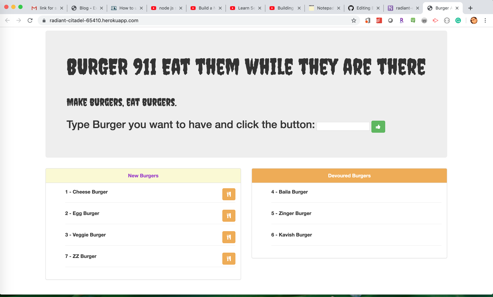

# Eat-Da-Burger
Eat-Da-Burger - Assignment #14 (Node, Express, Handlebars)



 
**Project Description** - This burger app logger is created with MySQL, Node, Express, Handlebars and a homemade ORM (yum!). Be sure to follow the MVC design pattern; use Node and MySQL to query and route data in your app, and Handlebars to generate your HTML.

[APP DEMO](./public/assets/img/appdemo.gif)

## Application Heroku Link
The link below will give you direct access to Eat-Da-Burger web application using your web browser via the Heroku web service. (NOTE: There will be a momentary delay when first accessing the Heroku servers.)

* [Eat-Da-Burger](https://radiant-citadel-65410.herokuapp.com/)

## Local Environment Setup
To use Eat-Da-Burger web application application from your local environment, you must accomplish the following steps below:

**Step 1 - Clone my repo using the command line below.**
```
git clone https://github.com/shahriar998/Burger911.git
```
**Step 2 - Change directory to the cloned repo folder.**
```
cd Eat-Da-Burger
```
**Step 3 - Install all required NPM packages.**
```
npm install
```
**Step 4 - Open connection.js file and change the section with your password**
```
password: process.env.PASSWORD,
```
**Step 5 - Run the following command to upload data in workbench**

* Make sure you're in the `db` folder of your app.

* Start MySQL command line tool and login: `mysql -u root -p`.

* With the `mysql>` command line tool running, enter the command `source schema.sql`. This will run your schema file and all of the queries in it -- in other words, you'll be creating your database.

* Now insert the entries you defined in `seeds.sql` by running the file: `source seeds.sql`.

* Close out of the MySQL command line tool: `exit`.

**Step 6 - Start the application server using the command line below**
```
node server.js
```

## Author

Shahriar Bin Elias
